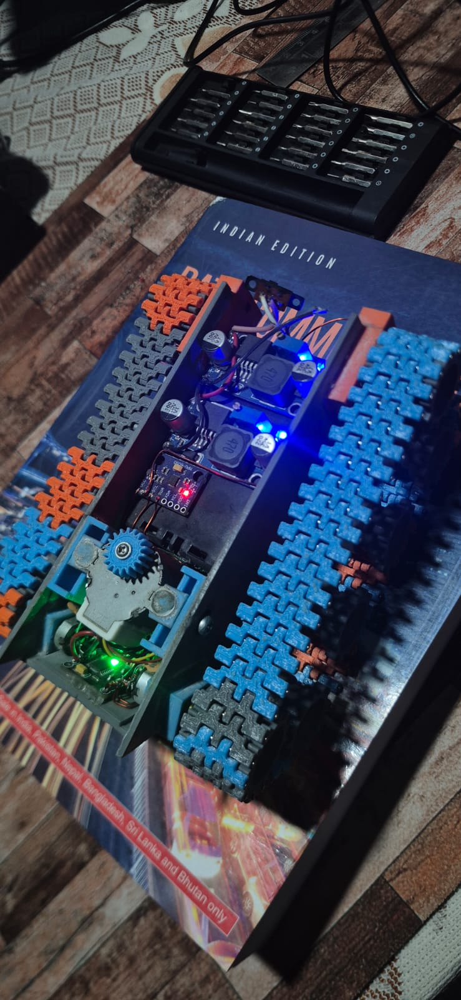

# ESP32-C3 WiFi Tank Controller

### A 3D-Printed Robotics Prototype

A custom-built tank prototype combining mechanical design, FDM 3D printing, embedded electronics, and a wireless browser-based control system.

## Project Overview

The goal of this project was to design, manufacture, assemble, and control a compact motorized vehicle. The mechanical structure includes a custom chassis, gears, and motor mounts designed using Tinkercad and fabricated using 3D printing.

An ESP32-C3 microcontroller hosts a mobile-friendly control interface over its own Wi-Fi network, allowing independent control of two DC motors without requiring internet access.

## Mechanical Design & Manufacturing

**CAD software:** Tinkercad
**Manufacturing method:** FDM 3D printing

### Custom-Designed Components

* **Chassis:** Structural platform for the vehicle.
* **Gears:** Mechanical transmission components.
* **Motor mounts:** Support and positioning for the drive motors.

### Design-to-Prototype Workflow

1. Developed the mechanical components in Tinkercad.
2. Exported the models as STL files.
3. Prepared the parts for 3D printing.
4. Printed and assembled the components.
5. Integrated the motors, motor driver, and controller electronics.
6. Tested the assembled prototype and refined the design where required.

## Prototype Gallery

Add photographs of the actual prototype here.

## Electronics & Control

* ESP32-C3 development board
* DRV8833 dual motor driver
* Two DC gear motors
* Battery and voltage regulation
* Wi-Fi access point
* LittleFS-hosted web interface

## Software

* Arduino / C++
* HTML
* CSS
* JavaScript
* PWM motor control

## How It Works

1. Connect a phone or laptop to the ESP32-C3 Wi-Fi network.
2. Open the controller webpage in a browser.
3. Use the two controls to command motor speed and direction.
4. Releasing the controls stops the motors and returns the controls to neutral.

## Design Considerations

The project brings together mechanical packaging, printed-part assembly, motor alignment, electronics integration, and a user-facing control interface.

Future iterations could explore improved gear durability, easier assembly, optimized material usage, and more compact component mounting.

## Project Files

* `mechanical-design/` — STL files for the chassis, gears, and mounts
* `images/` — Prototype photographs
* `firmware/` — ESP32-C3 firmware
* `web-interface/` — Browser control interface
* `hardware/` — Wiring and component documentation

## Project Status

Functional prototype with 3D-printed mechanical components and wireless dual-motor control.

### Assembled Prototype 1

### Assembled Prototype 2

### Assembled Prototype 3

### Assembled Prototype 4

### Assembled Prototype 5

### Assembled Prototype 6

### Assembled Prototype 7

### Assembled Prototype 8

### Belt Prototype 9

### Wheel Prototype 10

### 3D wheel stl 11

### 3D wheel stl 12

### 3D wheel stl 13

### 3D wheel stl 14

### 3D wheel stl 15

### 3D wheel stl 16

### 3D wheel stl 18

### 3D wheel stl 19

### 3D wheel stl 20

